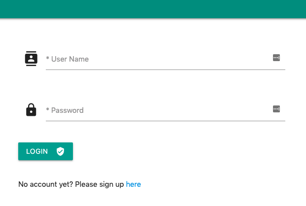
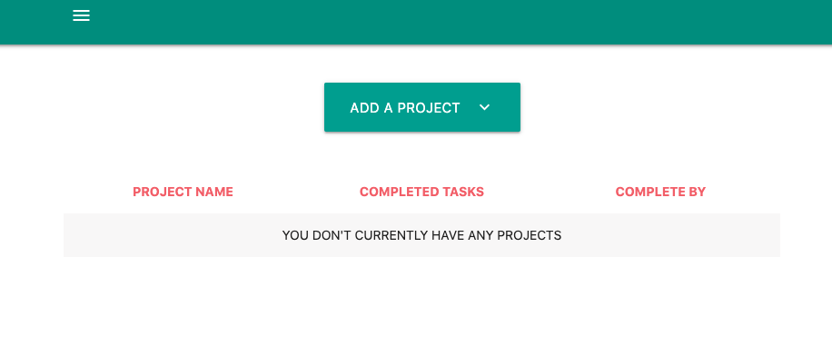
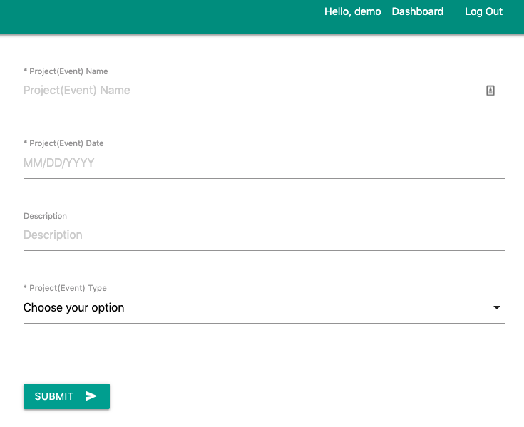
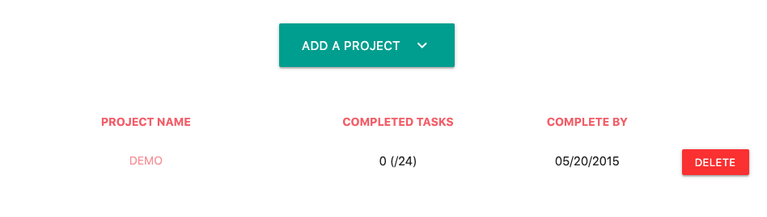
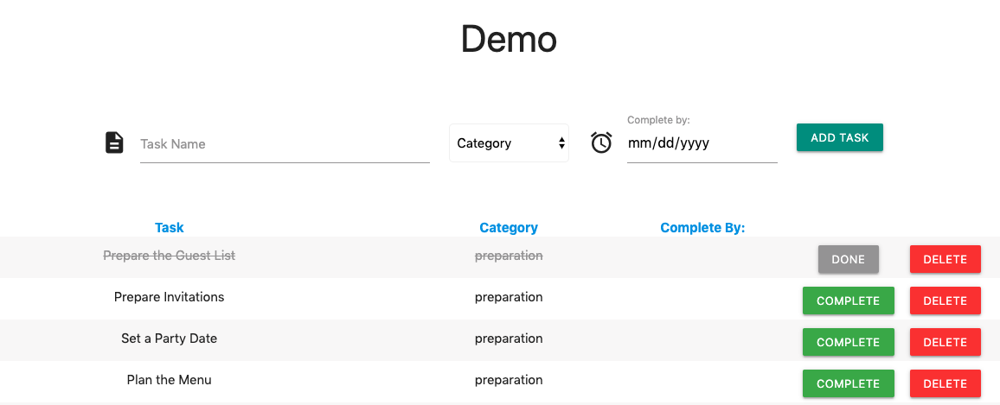

## Project title

Staying on Task: a roadmap to completing your projects

## Motivation

Every year, countless hours are spent on figuring out and writing down the tasks needed to complete a project, where, instead, this time could be used to executing and completing them.

StayingOnTask helps users cut down the time needed to create tasks and manage their projects.

Our first themes are birthday parties and weddings that come with prepopulated tasks for each event

## Tech/framework used

This app uses MySQL, Node.js, HTML, Javascript, Express, Passport, Handlebars and Sequelizer, EsLint, TravisCI, Materialize, Moment and DotEnv.

## Features

1) User has an authentication page for login and sign up. 

2)	Users can add projects with prepopulated tasks

3)	A dashboard with a list of all of the projects for that user

4)	A task page with all of the tasks under that project

Notes: Users can add their own tasks, if they so chose and delete the prepopulated tasks.

## Deployed Site

App is deployed on Heroku using JawsDB: https://project2-efm-st-cb.herokuapp.com/

## Credits

This project had 3 contributing members. Here are their GitHub links: Elisa: https://github.com/efemar?tab=repositories, Sunny: https://github.com/SunnyTong2019, Christin: https://github.com/ZomblesaurusRex
